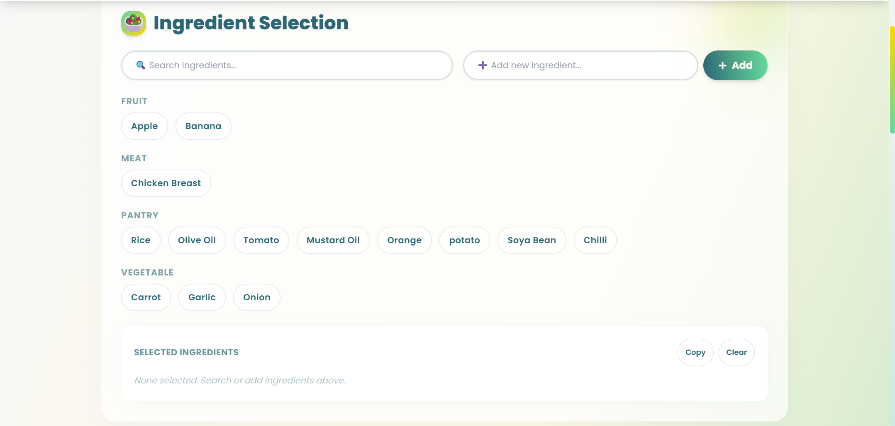
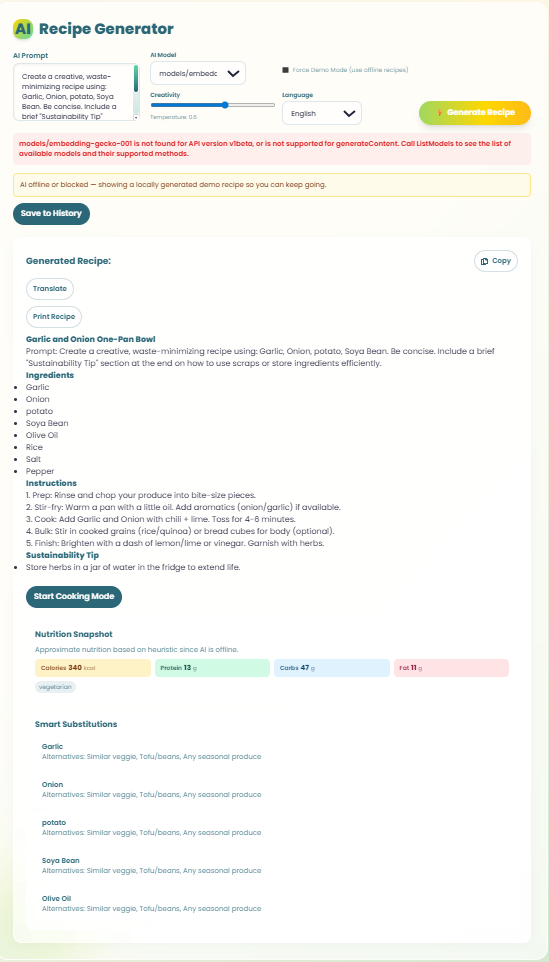

# 🍳 Curi-Cuisine

**AI-powered recipe generator to reduce food waste.**

[](https://react.dev/) [](https://vitejs.dev/) [](https://expressjs.com/) [](https://makersuite.google.com/app/apikey)

---

## 🚀 Features
- **Ingredient Bank**: Add, scan (camera), or speak ingredients
- **AI Recipe Generator**: Multiple Gemini models, creativity controls
- **Cooking Mode**: Step-by-step, voice read-out, print-friendly
- **Recipe History**: Save, load, delete, import/export markdown
- **Nutrition & Substitutions**: AI-powered, with offline fallback
- **Sustainability Dashboard**: Track meals saved, waste reduced
- **Multi-language Translation**: Translate recipes instantly

---

## 🛠️ Setup

1. **Install Node.js 18+**
2. **Create `.env` in project root** (see `.env.example`):
   ```env
   GEMINI_API_KEY=your_google_generative_ai_key
   GOOGLE_VISION_KEY=your_google_vision_key
   PORT=3001
   ```
   *Tip: The app works in demo mode if keys are missing.*

3. **Install dependencies**:
   ```bash
   npm install
   cd curi-cuisine
   npm install
   cd ..
   npm run dev:full
   ```

   **Optional (local image classification):**
   If you prefer to run image classification in the browser instead of using a cloud Vision API, install the TFJS packages inside the client:
   ```bash
   cd curi-cuisine
   npm install @tensorflow/tfjs @tensorflow-models/mobilenet
   ```
   Then enable "Use local TFJS classifier" in the Camera Scanner UI.

- Frontend: [http://localhost:5173](http://localhost:5173)
- Backend: [http://localhost:3001](http://localhost:3001)

Run a quick smoke test suite from the project root:

```bash
npm run qa
```

This will exercise core API endpoints (health, generate, translate, recipes) and exit non-zero if any check fails.

---

## 🧪 API Endpoints
- `POST /api/generate` — Generate recipe
- `POST /api/vision` — Scan ingredients (camera)
- `GET/POST /api/ingredients` — Manage ingredients
- `GET/POST /api/statistics` — Dashboard stats
- `GET/POST/DELETE /api/recipes` — Recipe history
- `GET /api/webinfo?q=term` — Enrich with TheMealDB
- `POST /api/analyze` — Nutrition/substitutions
- `POST /api/translate` — Translate recipe
- `GET /api/config-check` — Check API keys
- `GET /api/diagnose/llm` — Gemini API health

---

## 💡 Demo Tips
- Try different Gemini models for speed/quality
- Use Cooking Mode for hands-free step navigation
- Import/export recipes as markdown
- App works offline with fallback logic

---

## � Screenshots







---

## �📚 Further Reading
- [Strategic Report](curi-cuisine/STRATEGIC_REPORT.md)
- [Frontend Quick Start](curi-cuisine/README.md)
- [How to Get Your API Key](GET_API_KEY.md)
